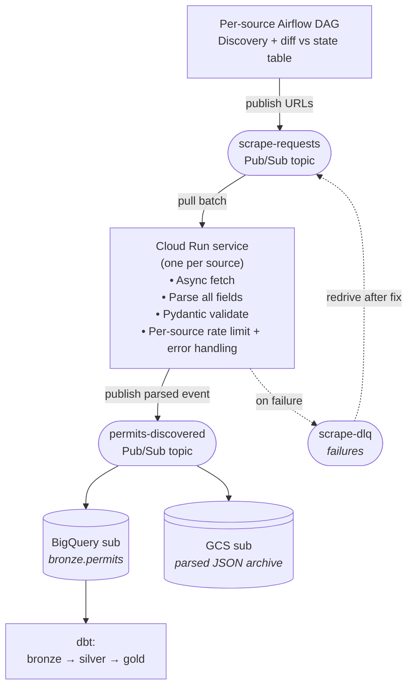

# TABS Scraper

This project consists of an async scraper for the Texas Architectural Barriers Projects of the tdlr.texas.gov website. The scraper takes in standard project URLs and parses the print-view URL and writes a JSON file with the specified fields. There are two ways to output, the standard is running without any flags and that outputs a full JSON payload with every field. The second output is by adding the --strict flag which limits the output to the five fields listed in the original assignment guidelines. The standard output dynamically captures every field without modifying the JSON schema so future additions don't need to re-fetch the data from the source output without re-fetching.

## Quickstart

Requires Python 3.12 and [uv](https://docs.astral.sh/uv/).

```bash
uv sync
uv run python -m tabs_scraper                       # full output → output/permits.json
uv run python -m tabs_scraper --strict              # assignment-schema only → output/permits.strict.json
uv run python -m tabs_scraper --urls-file urls.txt  # explicit URL list (default: urls.txt)
uv run python -m tabs_scraper -v                    # DEBUG logging
```

CLI flags:

| Flag | Default | Purpose |
|------|---------|---------|
| `--urls-file PATH` | `urls.txt` | Newline-separated URL list (`#` comments + blanks ignored) |
| `--output PATH` | `output/permits.json` | Full payload destination (mapped fields + `raw_fields` + provenance) |
| `--strict-output PATH` | `output/permits.strict.json` | Strict-mode destination |
| `--strict` | off | Write only the 5 assignment-schema fields; suppresses the full file |
| `-v / --verbose` | off | DEBUG logging (per-URL fetch + parse trace) |


## Output Schema

The required mapping from the assignment:

| Mapped field       | Source field                                  |
|--------------------|-----------------------------------------------|
| `event_id`         | Project Number                                |
| `address`          | Location Address                              |
| `event_created_at` | Start Date (parsed `M/D/YYYY` → ISO date)     |
| `description`      | Project Name + Type of Work + Scope of Work (joined with `\n\n`) |
| `category`         | Type of Work                                  |

**Full output** (`permits.json`) adds:

- `raw_fields` — every `<dt>/<dd>` pair scraped from the page (Facility Name,
  Estimated Cost, Owner Name, Design Firm, Square Footage, Current Status, etc.)
- `source_url` — the original URL passed in (preserved for provenance, not the
  print URL we actually fetched)
- `scraped_at` — UTC timestamp of the run
- `parser_version` — bumped on parser breaking changes; lets downstream consumers
  filter or re-process

**Strict output** (`permits.strict.json`, written when `--strict` is set) drops
`raw_fields` and metadata - exactly the 5 assignment fields, nothing else.

A pre-generated `output/permits.json` and `output/permits.strict.json` are
checked into the repo as evidence of a working run.

### Source-data edge cases

- **Missing `Scope of Work`.** The `description` join drops empty parts rather
  than emitting a literal blank or `"None"`. For permits where the source page
  omits a component (e.g. `EABPRJ93000456` has no Scope of Work), `description`
  contains only the parts that were present, joined with `\n\n`. `event_id`,
  `address`, `event_created_at`, and `category` remain required and will fail
  the permit if missing.
- **Placeholder dates.** Some legacy permits use `1/1/1900` as a `Start Date`
  placeholder (e.g. `EABPRJ93000456`). The scraper parses these to
  `1900-01-01` rather than dropping or normalizing them, the value reflects
  what the TDLR page actually publishes. Filtering placeholder dates can be
  handled in downstream data models.

## Production Architecture Diagram



### Key design decisions

1. **Discovery decoupled from scraping.** Airflow does discovery and publishes
   the URLs to a Pub/Sub topic that is dynamic and event-driven.
2. **One Cloud Run service per source.** A Cloud Run Operator per source acts as a listener
   for any published URLs from the Airflow discovery job. This allows for any missed records
   that fall into the Dead Letter Queue to flow through the same pattern after addressing
   the cause for failure.
3. **Cloud Run service over Cloud Functions.** The reason for not going completely serverless
   is Cloud Functions per-invocation cold-start cost matters at scale. An always on service 
   has advantages such as rate-limiting that are not afforded on a Cloud Function architecture.
4. **Pub/Sub fan-out at output.** One topic gets published and multiple subscribers handle different
   tasks without separate compute. BigQuery has a subcription that writes structured rows to
    `bronze.permits`, GCS subscription archives parsed JSON for replay. 
5. **Full parsed JSON in events, not raw HTML.** Comprehensive parsing extracts
   every field on the page into `raw_fields`. Re-parsing for future schema
   additions doesn't require re-scraping or HTML retention.
6. **Dead Letter Queue driven recovery.** Failed messages land in a separate dead letter queue topic.
   After a parser fix, redrive from DLQ. Item-level recovery without re-running the whole
   batch.
7. **Airflow handles batch-level health.** DLQ handles per-item failures.
   Airflow handles "did discovery actually run today? did it find 0 permits
   because there are none, or because the page broke?"

### Alternatives Considered

- **Cloud Function per URL.** Cold-start tax on every fetch, no in-process rate
  limit, fan-out coordination overhead at "is the batch done?" semantics. Cloud
  Run service is strictly better for batched, scheduled work.
- **Keeping logic in Airflow operator.** Turns the orchestrator into a full executor.
  Airflow can handle it but it becomes extremely messy when trying to troubleshoot
  complex jobs. 
- **GKE / Kubernetes.** Overkill at this volume. Cloud Run is serverless K8s
  under the hood without the operational burden.
- **Raw HTML retention.** When the output is not complex storing the raw html
  genuinely serves no purpose alongside the full output. If PDFs or images are 
  needed in the future the pattern can be changed.

## Implementation Choices

| Choice | Why |
|--------|-----|
| **Python 3.12** | Matches M******r's existing stack (Airflow + dbt). |
| **`httpx` async + `asyncio.Semaphore`** | I/O-bound work; async beats threads for clarity. Semaphore = explicit concurrency cap |
| **`tenacity` for retries** | 3 attempts, exponential backoff with jitter, scoped to 5xx + connection/timeout errors. 4xx fails fast. |
| **BeautifulSoup + `lxml`** | Print view is flat HTML with predictable `<dt>/<dd>` structure. `lxml` for speed; BS4 for easy traversal. |
| **Pydantic** | Output enforcement, JSON serialization |
| **Print-URL normalization** | All input URLs are normalized to print view, this creates a much lighter and easier to parse view. Original URLs are preserved in the `source_url` field for auditing. |
| **Parse all `<dt>/<dd>` pairs** | The 5 required fields are mapped from a comprehensive parse. If M******r adds fields tomorrow, replay from `raw_fields` without re-scraping. This also captures any new fields that are added at the source. |
| **Per-URL error containment in the pipeline** | The client layer is fail-fast (raises on 4xx/5xx after retries). The pipeline catches per-URL and logs, one bad page doesn't sink the batch. Exit code reflects whether any URL failed. |

## Time Cuts

- **GitHub Actions CI.** Lint + type-check + test on push. Trivial to add;
  skipped purely for time.
- **Dockerfile.** Mentioned in the architecture section, not built. Needed for 
  Cloud Run but only relevant for production purposes.
- **Idempotency / `MERGE` semantics.** `event_id` (Project Number) is the
  natural key. Re-running the scraper is currently safe (overwrite output);
  in production, the BigQuery subscriber would `MERGE` on `event_id`.
- **`Retry-After` header.** The retry policy uses jittered exponential
  backoff but ignores `Retry-After` on 429/503. Fine for a 5-URL batch; at
  production volume this should pull `exc.response.headers["Retry-After"]`
  and feed it into the wait strategy.
- **Per-host vs per-process concurrency.** `MAX_CONCURRENCY = 5` is a
  process-wide semaphore. Adequate for one source. The Cloud-Run-per-source
  architecture below makes this per-host by construction; if multiple
  sources ever shared a process, the semaphore would need to be keyed by
  host.

## AI Usage

I used Claude Code throughout this assignment:

- **Architecture**: Using existing design patterns I used Claude to battle test them
  and validate my decision making process. Pushing back on the overall production
  suggestion from Claude and using what was listed above. 
- **Scaffold (`pyproject.toml`, package layout, ruff/mypy config, `.gitignore`)**:
  generated by Claude, reviewed by me.
- **Source code (`parser.py`, `client.py`, `pipeline.py`,
  `url_utils.py`, `config.py`, `__main__.py`)**: pair-programmed with Claude.
  I drove the behavior decisions (multi-`<dd>` join with `, `, description
  joined with `\n\n`, section-label namespacing for duplicate `<dt>` keys, the
  `--strict` flag and two-file output split). Utilized Claude to write the bulk of the
  code. I reviewed every diff before committing and pushed back when an
  approach felt wrong.
- **Tests**: Claude drafted the test files; I directed which cases to cover
  and reviewed assertions against actual scraper output.

## Validation:

- 30 unit tests pass (`uv run pytest`)
- `mypy --strict` clean over `src/tabs_scraper`
- ruff lint clean
- End-to-end run against all 5 live URLs produced the committed
  `output/permits.json` and `output/permits.strict.json`; values were spot-checked
  against the rendered TDLR pages

## Testing

```bash
uv run pytest               # full suite
uv run pytest -q            # quiet
uv run pytest tests/test_parser.py -v
```

What's covered (30 tests):

- `test_url_utils.py` — print-URL normalization across all input URL shapes
  (`/Project/`, `/Projects/`, `/Search/Print/`); rejection of malformed URLs.
- `test_config.py` — `load_urls()` strips comments, blanks, and duplicates.
- `test_models.py` — Pydantic validation on `TabsPermit` (required fields,
  date coercion, JSON round-trip).
- `test_parser.py` — runs against `tests/fixtures/TABS2024012754.html`. Asserts
  all five required source fields are extracted, address spans are joined
  correctly, `<sup>` elements fall through, and duplicate `<dt>` keys are
  namespaced by section.
- `test_pipeline.py` — `transform_to_permit()` mapping, strict-mode dict
  shape, partial-success behavior on a fetch failure, `run()` writes correct
  files for each output mode.

What's not covered:

- **Live HTTP integration.** No tests hit the real TDLR site (would be flaky in
  CI and impolite). The end-to-end check is the committed `output/permits.json`.
- **Multi-fixture parser coverage.** Only one HTML fixture; see Time-cap
  Acknowledgments.

## Future Work

Outside the 2-hour scope, but described in detail in the Production
Architecture section:

- Airflow DAG for per-source discovery + diff
- Pub/Sub publisher to fan parsed events out to BQ + GCS
- BQ loader writing to `bronze.permits` with `MERGE` on `event_id`
- Dockerfile + Cloud Run deployment per source
- GitHub Actions CI (lint, type, test, parser-fixture regression)
- Structured JSON logging + observability hooks
